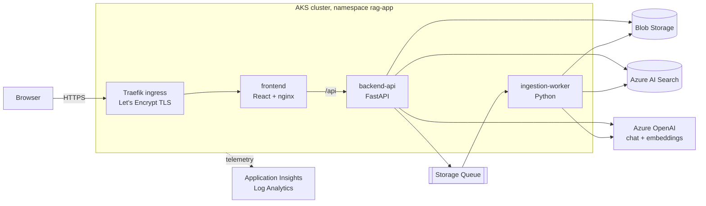
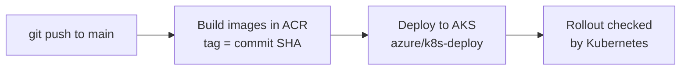

# Azure-Cloud-AI

A RAG (retrieval-augmented generation) Q&A app, built to show how I design, deploy and operate a real workload on Azure: **upload a PDF, ask questions, get answers with page citations.**

It runs on **Azure Kubernetes Service (AKS)**, is deployed entirely by **GitHub Actions**, builds its infrastructure from **Bicep**, and uses **managed identity** instead of keys.

**Live demo:** https://azure-cloud-ai.eastus.cloudapp.azure.com
The cluster is stopped when I'm not using it to save money, so the site may be offline. Ask me and I'll start it.

[](https://github.com/dhanishetty/Azure-Cloud-AI/actions/workflows/build-push-images.yml)
[](https://github.com/dhanishetty/Azure-Cloud-AI/actions/workflows/deploy-app.yml)

<!-- Add screenshots here: the live site, the green pipelines, Application Insights. Example:
 -->

## What it does

1. Upload a PDF. The API stores it in Blob Storage and queues a job.
2. A worker splits the text into chunks, creates embeddings with Azure OpenAI, and indexes them in Azure AI Search.
3. Ask a question. The API runs a hybrid search (vector and keyword) for the best chunks, sends them to a GPT-5 model, and returns an answer with page citations.

## Architecture



The pods reach Storage, Search and OpenAI with **Azure managed identities** through AKS Workload Identity. No connection strings or API keys.

## CI/CD



GitHub Actions logs in to Azure with **OIDC** (a federated credential), so no passwords or service principal secrets are stored in GitHub.

## What this project demonstrates

| Area | What I did |
|---|---|
| Containers | Multi-stage Docker builds for a React frontend, a FastAPI backend and a queue worker |
| Kubernetes | Deployments, Services, ServiceAccounts, probes, resource limits, rollout strategy tuned for a one-node cluster |
| Infrastructure as code | Bicep for ACR, AKS, Storage, Azure OpenAI, identities and role assignments, monitoring |
| CI/CD | GitHub Actions: image builds in ACR, SHA-tagged deploys, manual infra workflows |
| Identity and security | OIDC for pipelines, managed identities with least-privilege roles, Workload Identity for pods, storage keys and OpenAI keys disabled, HTTPS only |
| Networking | Traefik ingress, cert-manager with Let's Encrypt, Azure DNS label hostname |
| Observability | Application Insights (requests, failures, latency), Container Insights, log daily cap |
| Cost control | AKS Free tier, one small node, Free AI Search, stop/start the cluster, budget alert |

## Azure services

| Service | Role |
|---|---|
| AKS (Free tier, 1 x `Standard_B2s`) | Runs the app |
| Azure Container Registry (Basic) | Stores the images |
| Azure Storage | PDFs (Blob) and the ingestion queue |
| Azure AI Search (Free) | Vector and keyword index |
| Azure OpenAI | `gpt-5-mini` for answers, `text-embedding-3-small` for embeddings |
| Managed identities | `id-api`, `id-worker` |
| Application Insights, Log Analytics | Telemetry and logs |

## Repository layout

```
.github/workflows/   CI/CD and infra deployment workflows
infra/               Bicep: acr, aks, data-ai, identity, monitoring
k8s/                 Kubernetes manifests (+ platform/ for Traefik and cert-manager setup)
Code/Frontend/       React + Vite + TypeScript SPA, served by nginx
Code/Backend/RAG/    backend-api (FastAPI) and ingestion-worker
docs/                Architecture notes
implementation.md    Step-by-step record of how I built it
```

## Workflows

| Workflow | Trigger | What it does |
|---|---|---|
| `build-push-images.yml` | Push to `Code/**` or `k8s/**` | Builds the three images in ACR, tagged with the commit SHA |
| `deploy-app.yml` | After a successful build | Deploys the SHA-tagged images to AKS |
| `deploy-acr.yml` | Manual | Creates the resource group and ACR |
| `deploy-aks.yml` | Manual | Creates the AKS cluster |
| `deploy-data-ai.yml` | Manual | Creates Storage and Azure OpenAI |
| `deploy-identity.yml` | Manual | Creates managed identities and role assignments |
| `deploy-monitoring.yml` | Manual | Creates Log Analytics and Application Insights |

## How I built it

[`implementation.md`](implementation.md) records every step in order, with the commands, what each one does, and the problems I hit and how I fixed them (for example a federated credential subject mismatch, a stuck rollout on a full node, and moving from keys to managed identity).

## Cost

Roughly **$30-40 per month if the cluster runs all the time**, mostly the one VM. When I stop the cluster (`az aks stop`), compute stops billing. The AKS control plane (Free tier), AI Search (Free) and storage cost little or nothing. Azure OpenAI is billed per token. These are estimates, so check current Azure pricing.

```powershell
az aks stop  -g rg-portfolio -n aks-azure-cloud-ai
az aks start -g rg-portfolio -n aks-azure-cloud-ai
```

To remove everything I created for this app: `az group delete -n rg-portfolio`.

## Limits and next steps

- One node and one replica per service: no high availability or autoscaling. Rollouts briefly stop the backend because the node has no spare room.
- The Free AI Search service is shared with another project of mine.
- `gpt-5-mini` is scheduled for retirement on 2027-02-09, so the model will need to be swapped (two values in `infra/data-ai.bicep`).
- Possible next steps: Gateway API ingress, pod security settings, network policies, horizontal autoscaling, and managed identity for Search with no keys at all.
