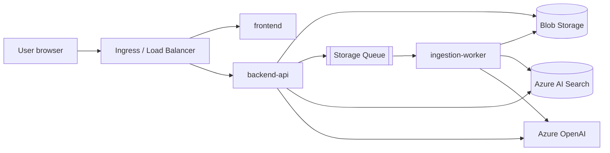
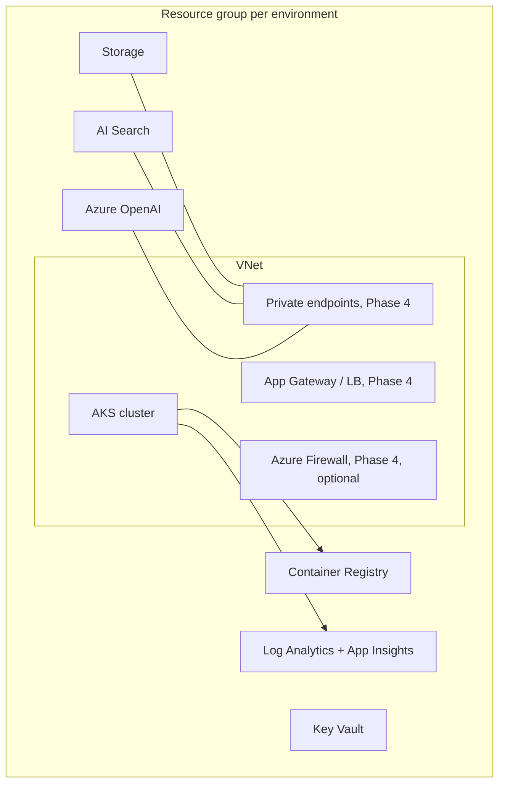

# Architecture

Status: **draft**, evolves with each roadmap phase. Decisions are recorded in `docs/adr/`.

## 1. Purpose
A RAG Q&A application (upload a PDF, ask questions grounded in it) used as the workload for a platform that demonstrates AKS, CI/CD, IaC, observability, and AIOps on Azure.

## 2. System context

## 3. Application containers
| Container | Role | Scales on |
|---|---|---|
| frontend | Nginx serving the SPA | CPU (HPA) |
| backend-api | FastAPI: `POST /documents`, `POST /ask`, `GET /documents/{id}/status` | CPU or requests (HPA) |
| ingestion-worker | Queue consumer: chunk, embed, write vectors | Queue length (KEDA, 0 to N) |

Upload is decoupled from processing: the API writes the blob and enqueues a message; the worker drains the queue at its own pace. All tiers are stateless.

## 4. Platform layout (target)

## 5. Identity: managed identity everywhere (no keys)
Goal: no connection strings, API keys, or client secrets in code, config, pipelines, or Key Vault.

| Caller | Identity type | Mechanism | Target | Role |
|---|---|---|---|---|
| AKS kubelet | System-assigned (cluster) | built in | ACR | `AcrPull` |
| backend-api pod | User-assigned `id-api` | Workload identity (federated credential to its Kubernetes ServiceAccount) | Storage | Storage Blob Data Contributor, Storage Queue Data Message Sender |
| | | | AI Search | Search Index Data Reader |
| | | | Azure OpenAI | Cognitive Services OpenAI User |
| ingestion-worker pod | User-assigned `id-worker` | Workload identity | Storage | Blob Data Reader, Queue Data Message Processor |
| | | | AI Search | Search Index Data Contributor, Search Service Contributor |
| | | | Azure OpenAI | Cognitive Services OpenAI User |
| Pipelines | Service connection | Workload identity federation (no secret) | RG | Contributor (infra) / AcrPush (CI) / AKS user (CD) |
| Optional: Secrets Store CSI | `id-csi` | Workload identity | Key Vault | Key Vault Secrets User |

Consequences:
- Application code uses `DefaultAzureCredential()`. The same code works locally (`az login`) and on AKS.
- Storage, Search, and OpenAI resources should have key / shared-key auth disabled once the apps use identities. That makes "no keys" enforceable.
- Role assignments and federated credentials live in Bicep (`modules/rbac.bicep`). The Kubernetes ServiceAccount carries only the identity's client ID annotation, which CD reads from infra outputs.
- Key Vault stays for anything that is genuinely a secret (there should be few or none).

## 6. Environments
dev, staging, prod. Separate resource groups, same Bicep modules, different parameter files. See `docs/environments.md` (to be written).

## 7. Cross-cutting
- **Observability:** Container Insights, Managed Prometheus, OpenTelemetry traces into Application Insights, alert rules (Phase 5).
- **Security:** private endpoints, network policies, WAF, Defender for Cloud (Phase 4 and 7).
- **Cost:** expensive resources (Firewall, App Gateway, extra node pools) are behind Bicep boolean parameters.

## 8. Open questions
- Ingress choice: NGINX ingress vs Application Gateway for Containers.
- Deployment tool: Helm vs Kustomize.
- GitOps adoption timing.
